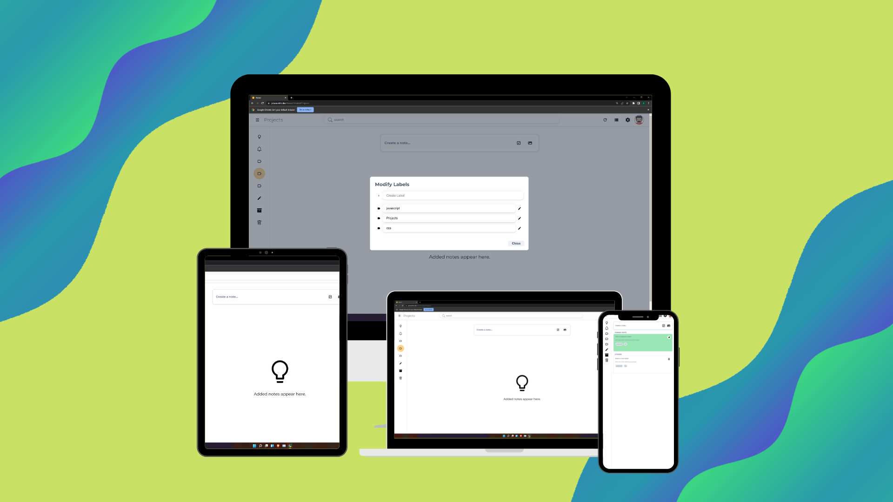

# Noted

Noted is a clone Application for Google Keep Note. It is used for creating notes and maintaining them using ReactJS.


## Installation

To install the ReactJS Application, [download the zip](https://github.com/pranavelric/Noted.git) of this repository or clone it to your system run the following command to install all the dependancies of this project.

```
npm install
```

## Running the Code

Once the prerequisits are met and the environment is setup you can run the following commands. By default, the React JS will be presented to 3000 port.

```
npm run start
```

## Functionalities:
- [x] Ability to create a note with title and content
- [x] Ability to view all the created notes
- [x] Ability to add background colours to a note
- [x] Ability to pin a note
- [x] Ability to delete a note
- [x] Mobile responsiveness
- [x] Ability to archive a note
- [x] Ability to create and delete label
- [ ] Ability to  search notes
- [ ]  User authentication
- [ ]  Add images to notes
- [ ]  Add reminders to notes
- [ ]  Add collaborators to notes
- [ ]  Functionality to share notes
- [ ]  Download notes

## Screenshots:




